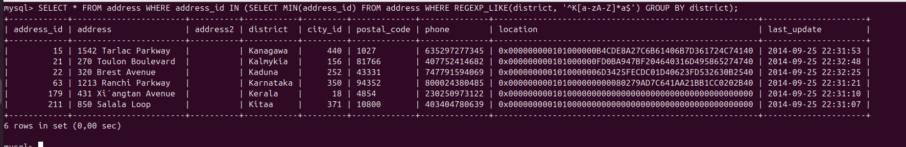
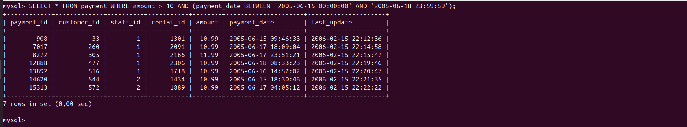

# Домашнее задание к занятию "SQL. Часть 1" - Политико Ксения

---

Задание можно выполнить как в любом IDE, так и в командной строке.

### Задание 1

Получите уникальные названия районов из таблицы с адресами, которые начинаются на “K” и заканчиваются на “a” и не содержат пробелов.

Запрос для выборки данных:
**SELECT * FROM address WHERE REGEXP_LIKE(district , '^K[a-zA-Z]*a$');**

### Задание 2

Получите из таблицы платежей за прокат фильмов информацию по платежам, которые выполнялись в промежуток с 15 июня 2005 года по 18 июня 2005 года **включительно** и стоимость которых превышает 10.00.

Запрос для выборки данных:
**SELECT * FROM payment WHERE amount > 10 AND (payment_date BETWEEN '2005-06-15 00:00:00' AND '2005-06-19 00:00:00');**

### Задание 3

Получите последние пять аренд фильмов.

Запрос для выборки данных:
**SELECT * FROM rental ORDER BY rental_id  DESC LIMIT 5;**

### Задание 4

Одним запросом получите активных покупателей, имена которых Kelly или Willie. 

Сформируйте вывод в результат таким образом:
- все буквы в фамилии и имени из верхнего регистра переведите в нижний регистр,
- замените буквы 'll' в именах на 'pp'.

Запрос для выборки данных:
**SELECT customer_id, store_id, REGEXP_REPLACE(LOWER(first_name), 'll', 'pp') AS first_name, last_name, email, address_id, active, create_date, last_update FROM customer WHERE active = 1 AND first_name IN ('Kelly', 'Willie');**

## Дополнительные задания (со звёздочкой*)
Эти задания дополнительные, то есть не обязательные к выполнению, и никак не повлияют на получение вами зачёта по этому домашнему заданию. Вы можете их выполнить, если хотите глубже шире разобраться в материале.

### Задание 5*

Выведите Email каждого покупателя, разделив значение Email на две отдельных колонки: в первой колонке должно быть значение, указанное до @, во второй — значение, указанное после @.

Запрос для выборки данных:
**SELECT REGEXP_SUBSTR(email, '^[a-zA-Z\.]+') AS first_part, REGEXP_SUBSTR(email, '[a-zA-Z\.]+$') AS last_part FROM customer LIMIT 10;**

### Задание 6*

Доработайте запрос из предыдущего задания, скорректируйте значения в новых колонках: первая буква должна быть заглавной, остальные — строчными.

Запрос для выборки данных:
**SELECT CONCAT(UPPER(SUBSTRING(a.first_part, 1, 1)), LOWER(SUBSTRING(a.first_part, 2))) AS login, CONCAT(UPPER(SUBSTRING(a.last_part, 1, 1)), LOWER(SUBSTRING(a.last_part, 2))) AS domain FROM (SELECT REGEXP_SUBSTR(email, '^[a-zA-Z\.]+') AS first_part, REGEXP_SUBSTR(email, '[a-zA-Z\.]+$') AS last_part FROM customer LIMIT 10) a;**

